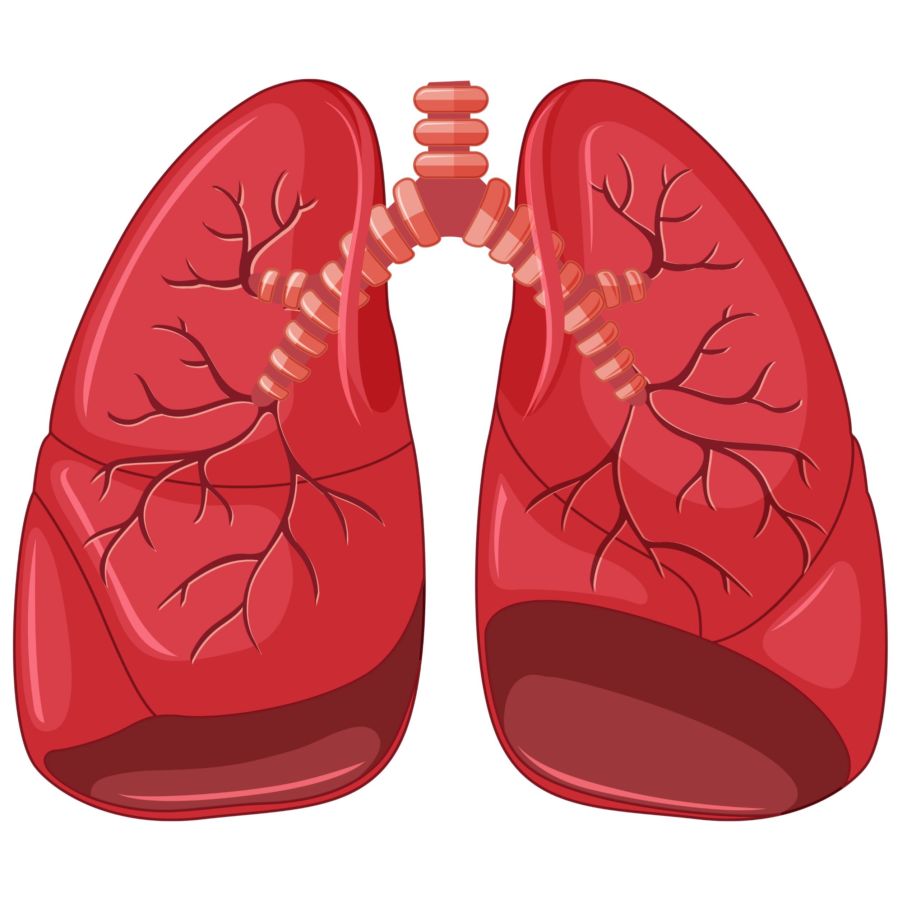

<div align="center">
  
  <h1>PulmonaryDetect 🫁</h1>
  <p><strong>Advanced AI-Powered Lung Disease Detection System</strong></p>

  [](https://www.python.org/)
  [](https://flask.palletsprojects.com/)
  [](https://www.tensorflow.org/js)
  [](https://opensource.org/licenses/MIT)
</div>

<br />

## 🌟 Overview

**PulmonaryDetect** is a state-of-the-art web application designed to assist healthcare professionals and researchers in detecting lung diseases from chest radiographs (X-rays). Utilizing deep learning via **TensorFlow.js** and **Google's Teachable Machine**, the system provides rapid, highly accurate preliminary analysis for conditions such as **Pneumonia** and **Tuberculosis**.

## 🚀 Key Features

- **High Accuracy AI Model:** Evaluates chest X-rays to classify them into Normal, Pneumonia, or Tuberculosis categories.
- **Client-Side Inference:** Powered by TensorFlow.js, the image processing and prediction happen entirely in the browser, ensuring user privacy and fast response times.
- **Support for Multiple Formats:** Upload standard images (PNG, JPEG, JPG) as well as medical imaging formats (**DICOM**).
- **Responsive & Modern UI:** A beautifully designed interface with a built-in Dark Mode, optimized for both desktop and mobile devices.
- **Comprehensive Metrics Tracking:** Built-in research announcements and performance metrics visualizations.

## 📊 Model Performance

Our model has been rigorously trained and tested, achieving outstanding evaluation metrics:
- **Accuracy:** 99.51%
- **F1-Score (Macro):** 99.51%
- **ROC-AUC:** 0.999994
- *Detailed performance charts (Loss, Confusion Matrix, Precision-Recall) can be found in the `/about` section of the web application.*

## 🛠️ Technology Stack

- **Backend:** Python, Flask
- **Frontend:** HTML5, Vanilla CSS (Custom Design System), JavaScript
- **Machine Learning:** TensorFlow.js, MobileNet Architecture (via Teachable Machine)
- **Medical Imaging:** DICOM parser integration

## 💻 Installation & Setup

To run this project locally on your machine, follow these steps:

**1. Clone the repository**
```bash
git clone https://github.com/Gimm17/PulmonaryDetect-Advanced-Lung-Disease-Detection.git
cd PulmonaryDetect-Advanced-Lung-Disease-Detection
```

**2. Create a Virtual Environment (Optional but recommended)**
```bash
python -m venv venv
# On Windows:
venv\Scripts\activate
# On macOS/Linux:
source venv/bin/activate
```

**3. Install Dependencies**
```bash
pip install -r requirements.txt
```

**4. Run the Application**
```bash
python app.py
```
*The application will be accessible at `http://localhost:5000`*

## 📁 Project Structure

```
├── static/
│   ├── css/          # Stylesheets (including dark-mode logic)
│   ├── js/           # Frontend logic, SPA routing, TF.js integration
│   ├── images/       # Web assets and research charts
│   └── model/        # Exported TensorFlow.js model weights & metadata
├── templates/        # Flask HTML templates (index, about, announcements)
├── app.py            # Main Flask application
├── requirements.txt  # Python dependencies
└── README.md         # Project documentation
```

## ⚠️ Disclaimer

> **Research Purposes Only:** This system is developed for research and educational purposes. It is **not** FDA/CE approved for clinical use. The AI predictions should not replace professional medical diagnosis, but rather serve as a supplementary tool to assist healthcare providers. Always consult qualified medical professionals for proper diagnosis and treatment decisions.

## 🤝 Contact

Developed as part of a research project to advance accessible pulmonary diagnostics through Artificial Intelligence. For any inquiries, please refer to the Creator Profile section within the application.
